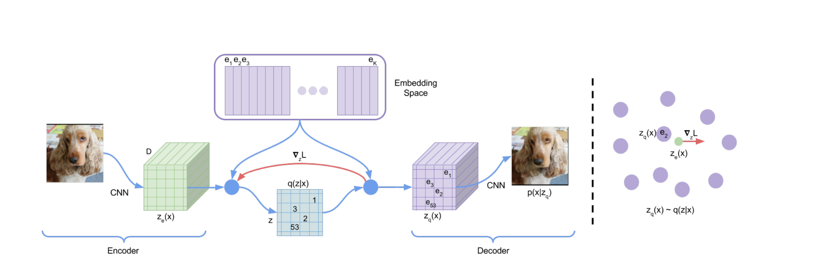
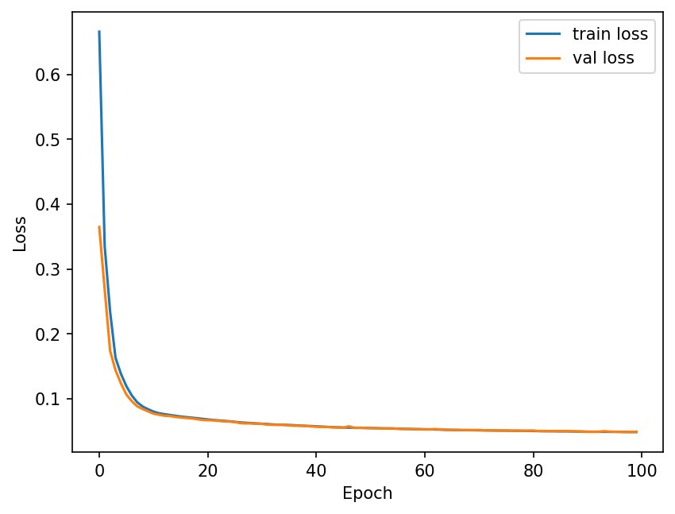
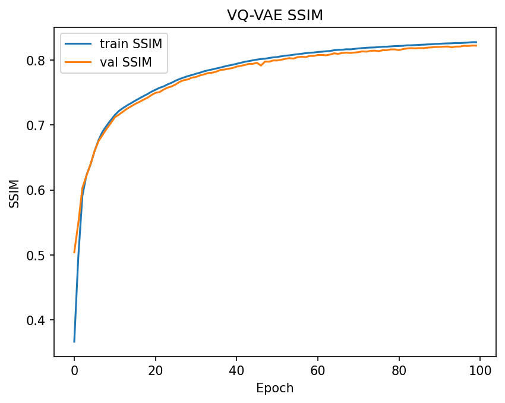
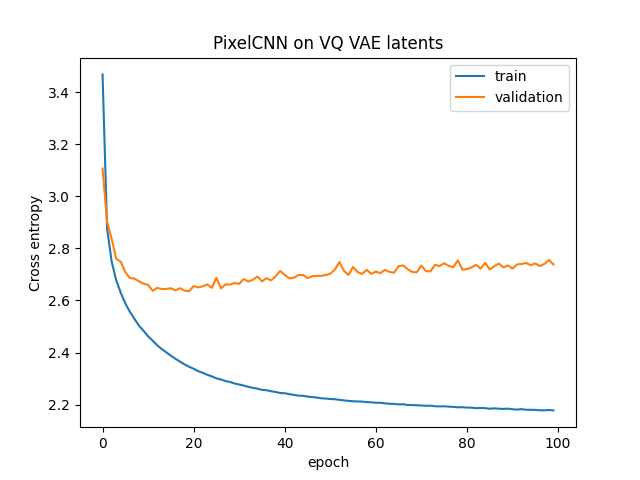
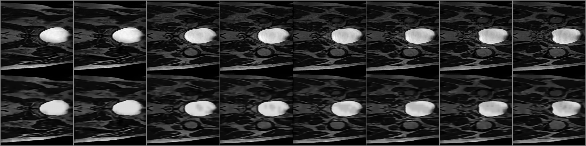
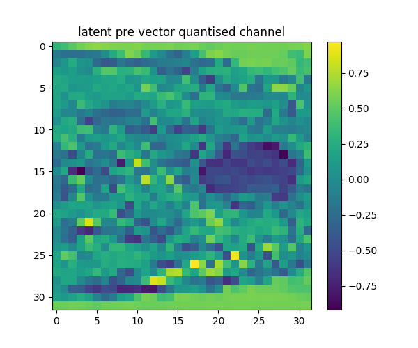
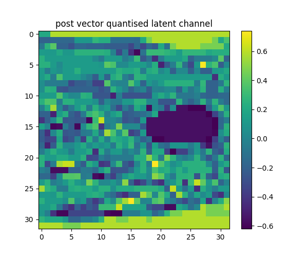
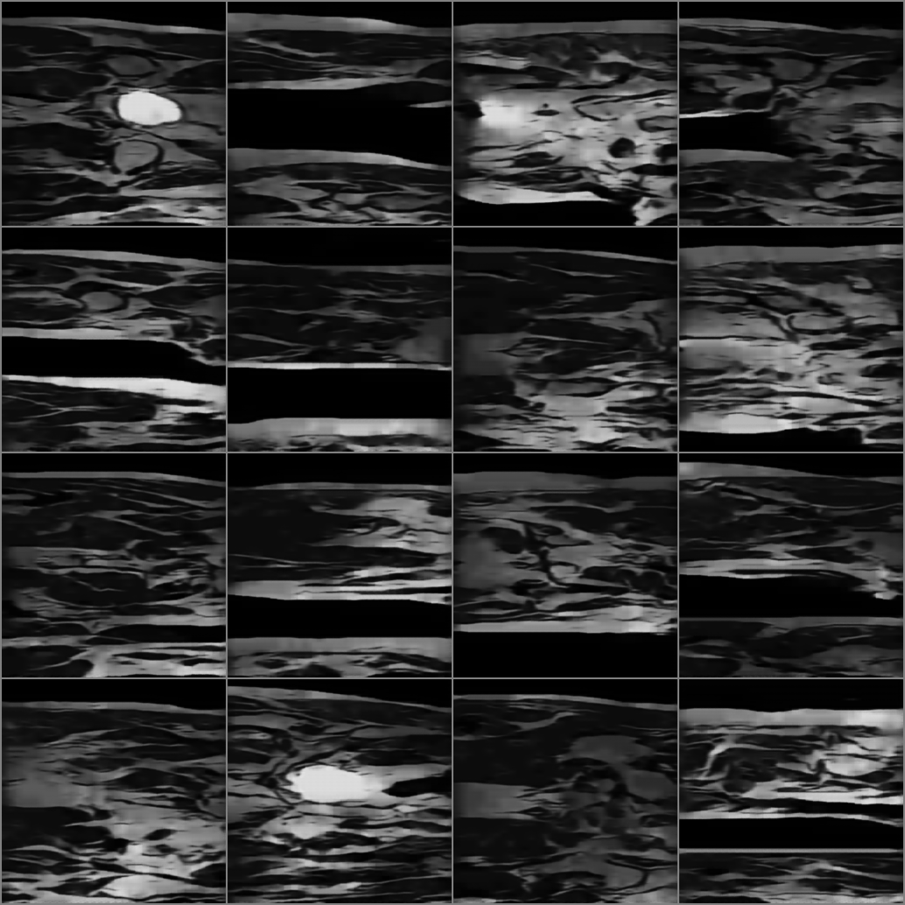

# VQVAE on HipMRI data slices
Author: James Miller (s47739912)

## Overview
This project implements a Vector quantised variational autoencoder (VQ-VAE) to learn compact, discrete representations
of 2D Hip MRI slices, and a pixelCNN that models the prior over VQ-VAE latents. New images are generated autoregressively sampling
a latent tensor with PixelCNN and decoding it with the VQ-VAE. The following project aims to use a pixelCNN to generate reasonably clear
images using the VQ-VAE which was trained to reconstruct with a target of SSIM > 0.60.

## VQ-VAE
A Vector Quantised Variational Autoencoder (VQ-VAE) is a neural network that learns to compress an image into a smaller, discrete
representation before reconstructing it. The encoder maps the image into a continuous latent space, which then gets quantised by 
replacing each latent vector with the nearest entry from a learned codebook of embedding vectors. This encourages the model to learn
meaningful features. The decoder then deconstructs the image from the codes producing realistic outputs that preserve important structural
details.

Van Den Oord, Aaron, and Oriol Vinyals. "Neural discrete representation learning." Advances in neural information processing systems 30 (2017).

### Architecture
The VQ-VAE uses three convolutional blocks with batch normalisation, ReLU activations and pooling to reduce the image size from 256x256
to a 32x32 latent space with 64 channels. A 1x1 convolution maps the features to the embedding dimension which is then quantised using a 512
entry codebook that replaces each latent vector with its nearest learned embedding. The decoder mirrors the encoder using transposed convolutions
and batch normalisation to upsample the quantised features back to the original image size. A sigmoid output is used to produce normalised reconstructions
between 0 and 1.

## Pixel CNN
A pixelCNN is an autoregressive model that learns to generate data one element at a time predicting each pixel based on previously generated ones.
when used with a VQ-VAE, the pixelCNN is trained on the latent space rather than a raw image, this causes it to learn the relationships between discrete
codes the VQ-VAE has produced. The pixelCNN is then used as a prior model where during image generation the pixelCNN samples a new grid of latent codes
which are decoded using the VQ-VAE into a new realistic looking image

### Architecture
The pixelCNN learns spacial dependencies between VQ-VAE embeddings. It begins with a masked convolution(type A) to enforce
autoregressive ordering, followed by 5 residual blocks combining 1x1 and 3x3 convolutions. The final layers project the output to match
the VQ-VAE 64 dimensional latent channels. The model is trained using MSE loss, the model predicts and samples latent grids that the VQ-VAE
can decode into new imagess.

## Data and Preprocessing
The dataset consists of 2D prostate MRI slices stored as NIfTI (.nii.gz) files. each slices was loaded, converted to grayscale and
resized to 256x256 to maintain consistency. Pixel values were then min-max normalised to 0-1. The data was given pre split for training,
validation and testing so no further splitting needed to be done before training.

## Parameters
All runtime settings live in parameters (see modules.py)
| Name | Type | Default | Description |
|---|---|---:|---|
| profile | str | local | select data root as local or rangpur. |
| img_size | (H, W) | (256, 256) | input/output image size |
| normalise | bool | True | min max normalises imgs |
| embedding_dim | int | 64 | VQ-VAE latent channel dimension |
| num_embeddings | int | 512 | codebook size |
| beta | float | 0.25 | VQ commitment loss |
| batch_size | int | 32 | training batch size |
| learning_rate | float | 1e-4 | Adam optimiser learning rate |
| epochs | int | 100 | VQ-VAE training epochs |
| recon_weight | float | 1 | weight on reconstruction in loss |
| device | torch.device | auto | Cuda if available else cpu |

## Training Performance
### VQ-VAE loss curves

### PixelCNN loss curve

## Test performance
### VQ-VAE original image vs reconstruction (random batch)
The model performed reasonably well on the test set achieving an avg_test_ssim of 0.8427

A plot of 8 original images alongside their reconstructions can be seen below

All the images in this batch suit the criteria of being reasonably clear with the primary difference
between original and reconstruction images being slight fuzziness / lack of clarity. This will reduce the performance
of the PixelCNN generated images, however the average SSIM was deemed high enough to train a pixelCNN to produce priors
for the model.

## latent representation of image 
Below latent represenations of the images are plotted (pre and post quantisation step)

## decoded PixelCNN generated priors

The images decoded from the generated priors can be seen below:

Many of the images follow the shape and structure of the MRI scans (notably the top left image looks close to real), however they lack clear detail and some have noticable warping / unrealistic proportions.
This indicates the model is succesfully generating priors which the VQ-VAE is decoding, however more tuning needs to be done to both models in order to create
images that are harder to distinguish from real ones. I.E the VQ-VAE could be improved to have higher SSIM on test set, and the pixelCNN could be improved to generate
more realistic priors.
## Dependencies

## Future improvements

